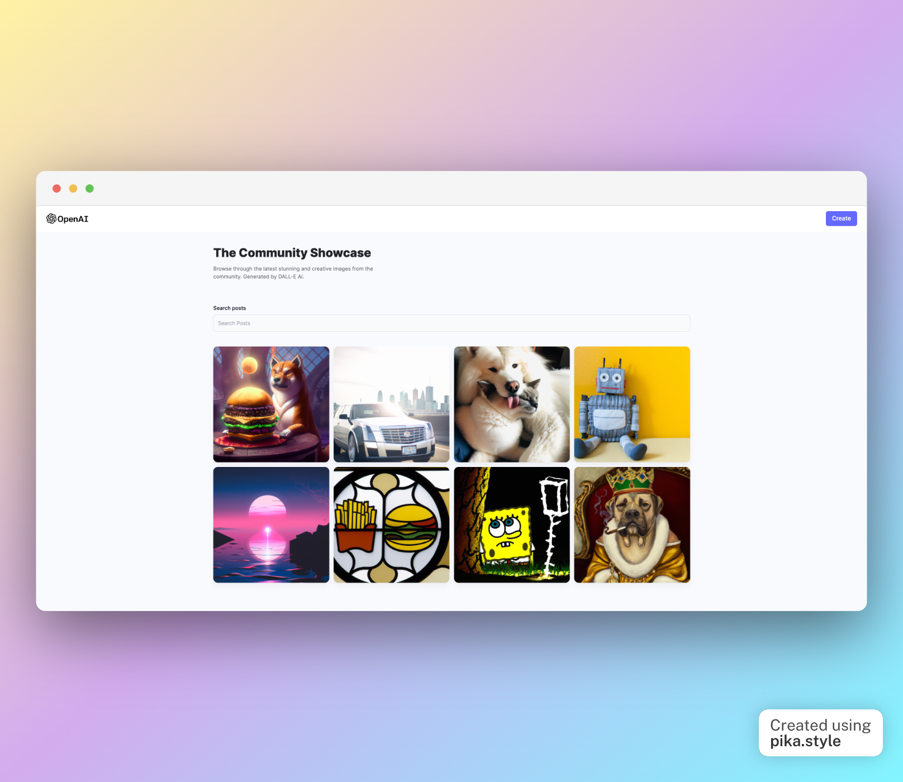

# AI Image Generation Application

This application utilizes OpenAI's DALL-E 2 API to generate images based on user prompts. The frontend is built with React, TailwindCSS and React-Router-Dom. The backend is built with Node.js, Express.js, Cloudinary for image upload and MongoDB with Mongoose.



## Features

- Generate unique images by providing a prompt
- Share generated images with the community
- Download generated images to your device

## Getting Started

### Prerequisites

- Node.js
- MongoDB
- Cloudinary account
- OpenAI API key (Requires an OpenAI account)

### Installation

1. Clone the repository

```
git clone https://github.com/YOUR_USERNAME/AI-image-generation
```

2. Install dependencies

```
npm install or yarn add
```

3.Create a .env file in the root directory with the following variables

```
MONGO_URI=YOUR_MONGO_URI
CLOUDINARY_URL=YOUR_CLOUDINARY_URL
OPENAI_API_KEY=YOUR_OPENAI_API_KEY
```

4. Start the application

```
npm start
```

## Built With

- React
- TailwindCSS
- React-Router-Dom
- Node.js
- Express.js
- Cloudinary
- MongoDB
- Mongoose
<hr>

# Author

- Bora KARACA
